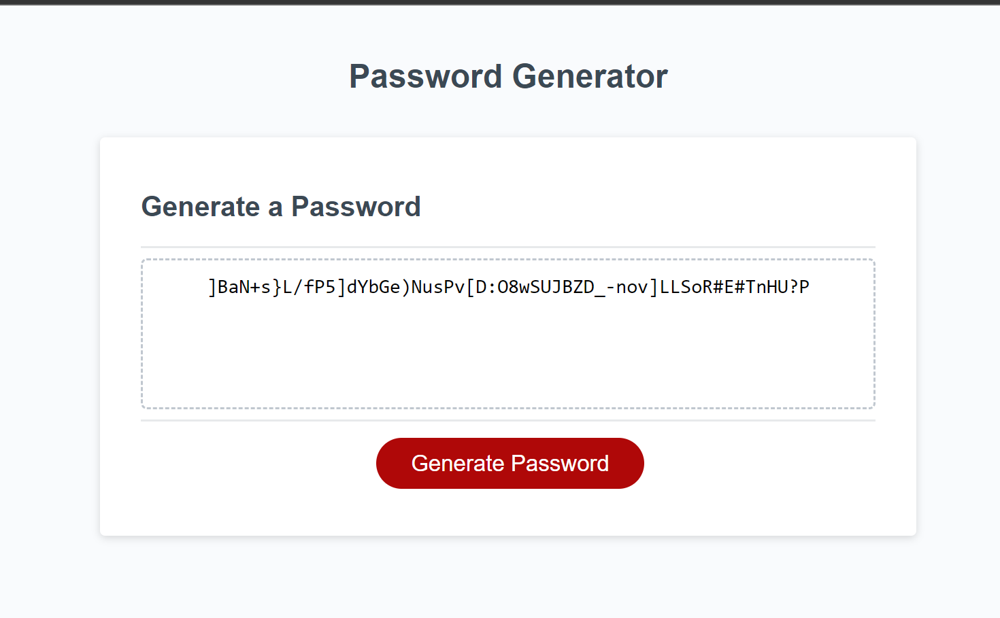

# Password-Generator
An application that an employee can use to generate a random password based on specific criteria.

## Description

The screenshot above is a task that entailed, using concepts I have recently learned in Javascript and putting them into practice. The skills acquired were used to create an application that an employee can use to generate a random password based on criteria they’ve selected by modifying starter code.

## Webpage

The link to my completed webpage file:///C:/Users/Annam%20Khalid/bootcamp/05-module/Password-Generator/index.html

## Credits

N/A

## License

Please refer to the LICENSE in the repo.
